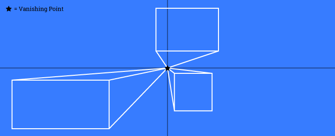

<div class="ButtonGroup ButtonGroup--gutter-md ButtonGroup--align-center">
  <a href="https://codepen.io/collection/AVWrrp/" class="Button Button--display-inlineBlock Button--appearance-secondary Button--size-sm">
    View Collection on CodePen
  </a>
</div>

In this tutorial, we’re going to take an in-depth look into CSS perspective, and some use-cases where it can give users more natural and cool experiences.

## What Is Perspective?

In the context of the two-dimensional world, perspective gives users the illusion of an object’s depth, width, height, and position in relation to another object, when viewed from a particular point. Perspective allows artists to create scenes that look like they are going “into” the paper, or draw buildings of different sizes on a street moving away from our position. Objects will also have a vanishing point, which is the point in the 2-D plane where an object’s depth vanishes. Let’s illustrate this with a simple diagram:



The above diagram depicts three objects, all rectangles, in a 2-D plane. When they are moved around the plane, lines of perspective can be drawn towards the vanishing point, and 3-dimensional objects can be extrapolated.

Since the web is viewed on two-dimensional surfaces (i.e. device screens), perspective can play a part in helping to create some similar depth. In the world of web and CSS transforms, perspective is defined like this (taken from the MDN):

> The perspective CSS property determines the distance between the z = 0 plane and the user in order to give to the 3D-positioned element some perspective. Each 3D element with z > 0 becomes larger; each 3D-element with z < 0 becomes smaller. The strength of the effect is determined by the value of this property.

The vanishing point is placed by default at the centre of the element, but we can reposition it with the `perspective-origin` property. Let’s look at a basic example.

## Demo 1 – A Basic Perspective Example

Let’s take a very primitive shape – a square – and use the perspective properties to give it a bit of depth. For the first sequence of demos, I’ll use some helper classes to show-off the following perspective ranges:

- no `perspective`
- 100px `perspective`
- 200px `perspective`
- `perspective-origin` at [0, 0]

Note that perspective properties must exist on the parent container of the element we want affected. With that in mind, the markup for the three demos will be really simple:

```html
<div class="perspective-container perspective--none">
  <span class="surface"></span>
</div>

<div class="perspective-container perspective--200">
  <span class="surface"></span>
</div>

<div class="perspective-container perspective--100 perspective-origin--00">
  <span class="surface"></span>
</div>
```

Let’s now apply the necessary CSS perspective properties:

```css
.perspective-container {
  width: 200px;
  height: 200px;
  background-color: #eee;
}

.perspective--none {
}

.perspective--100 {
  perspective: 100px;
}

.perspective--200 {
  perspective: 200px;
}

.perspective-origin--00 {
  perspective-origin: 0px 0px;
}

.surface {
  display: block;
  width: 100%;
  height: 100%;
  background-color: #377CFF;
}
```

If we refresh our browser, we will see three identical squares. Why? Because none of our objects have actually moved in the perspective plane. To see how the perspective properties affect our objects, let’s translate them along the z-axis into the plane using `transform`. We’ll add the following CSS to our `.surface` class that governs our objects:

```css
.surface {
  transform: translateZ(-50px);
}
```

Now, we can see three different results:

1. The first remains unchanged, because without any perspective rules in place, translating along the z-axis (i.e. in and out of the screen) causes no change in depth.
1. The second appears to have moved into the screen a bit, because we set the `perspective` to `200px`. Remember from the definition above that the perspective property determines the distance between the `z = 0` plane and the user.
1. The third appears even smaller still, and has moved to the top-left corner of our perspective container. This is because of the `perspective-origin` property set on the parent container.

Here it is in action:

<p data-height="360" data-theme-id="5513" data-slug-hash="BvOzZz" data-default-tab="result" data-user="callmenick" data-pen-title="A Basic CSS Perspective Example" data-preview="true" class="codepen">See the Pen <a href="https://codepen.io/callmenick/pen/BvOzZz/">A Basic CSS Perspective Example</a> by Nick Salloum (<a href="https://codepen.io/callmenick">@callmenick</a>) on <a href="https://codepen.io">CodePen</a>.</p>

## Demo 2 – Rotating Shapes With Perspective

At this point, the above effects could’ve just been achieved by simply scaling the elements. That’s a fair point, but in that case, we’d lose all perspective properties. Visualizing the perspective in the first demo might also be a bit difficult because ultimately, it’s just a smaller square. Let’s look at a slightly more advanced implementation, and paint a clearer picture.

This time, we’ll have the same three squares, but we will rotate them about the y-axis, making them rotate “into” the screen. We will use a CSS transition effect coupled with the `:hover` pseudo-class to animate how perspective properties affects the rotation. Here’s the markup:

```html
<div class="perspective-container perspective--none">
  <span class="surface"></span>
</div>

<div class="perspective-container perspective--400">
  <span class="surface"></span>
</div>

<div class="perspective-container perspective--400 perspective-origin--00">
  <span class="surface"></span>
</div>
```

This time, I added a perspective helper class at `400px` also like this:

```css
.perspective--400 {
  perspective: 400px;
}
```

Finally, let’s take a look at the CSS for our new shape:

```css
.surface {
  display: block;
  width: 100%;
  height: 100%;
  background-color: #377CFF;
  transition: transform 1s;
}

.perspective-container:hover > .surface {
  transform: rotateY(180deg);
}
```

Hovering over the three different implementations results in three different outcomes:

1. With no `perspective` set, the object rotates about the z-axis in a very flat manner. Nothing seems to pop in our out of the screen.
1. When we set `perspective` to `400px`, we can see that the object now looks like it is spinning out and back into the screen. This is because of `perspective`.
1. With the `perspective` set to `400px` and the `perspective-origin` moved to `[0 0]`, a similar effect to number 2 is achieved, but this time viewed from the perspective origin.

Here it is in action! Now, we’re starting to see the power of CSS perspectives.

<p data-height="360" data-theme-id="5513" data-slug-hash="ebLzKj" data-default-tab="result" data-user="callmenick" data-pen-title="Rotating Shapes with CSS Perspective" data-preview="true" class="codepen">See the Pen <a href="https://codepen.io/callmenick/pen/ebLzKj/">Rotating Shapes with CSS Perspective</a> by Nick Salloum (<a href="https://codepen.io/callmenick">@callmenick</a>) on <a href="https://codepen.io">CodePen</a>.</p>

## Demo 3 – 3D Cube With Variable Perspective Origins

Now, we’re going to get a little funky. We’re going to create a cube (with 6 faces) using CSS `transform`, and give that cube some depth using `perspective`. We will also set up a controller system so that we can edit the perspective and perspective origin on the fly, giving us a superior grasp on how perspective really affects everything.

We’ll set up our cube using 6 different `span` elements inside a parent `div` with the class of `cube-face`. Each `cube-face` will represent a different face of the cube. The cube itself will now reside inside a perspective `div`, called `cube`. Here’s the markup:

```html
<div id="cube" class="cube">
  <div class="cube-faces">
    <span class="cube-face cube-face--front"></span>
    <span class="cube-face cube-face--back"></span>
    <span class="cube-face cube-face--top"></span>
    <span class="cube-face cube-face--bottom"></span>
    <span class="cube-face cube-face--left"></span>
    <span class="cube-face cube-face--right"></span>
  </div>
</div>
```

We’ll set up some defaults for the perspective wrapping container, and the cube container will have relative positioning so that each of the cube faces can be absolutely positioned inside, and transformed accordingly. Assuming we want a cube where each side is `200px` in length, our CSS will look like this:

```css
.cube {
  perspective: 1000px;
  perspective-origin: 0px 0px;
}

.cube-faces {
  position: relative;
  margin: 100px auto;
  width: 200px;
  height: 200px;
  transform-style: preserve-3d;
}
```

Notice that I initially set the `perspective` to be `1000px`, and the `perspective-origin` to be `0px 0px`. This will give us some depth to work with initially so we can see transformed objects moving into and out of the plane. Remember, without `perspective`, transformed objects would not achieve that third-dimensional depth that we’re after.

Let’s examine the faces of the cube now. First of all, each face needs to be absolutely positioned and have a `width` and `height` of `200px`. I’ll apply some inner shadows to each face also, for visualisation purposes. Here’s the common CSS for the faces:

```css
.cube-face {
  position: absolute;
  top: 0;
  left: 0;
  display: block;
  width: 200px;
  height: 200px;
  background-color: rgba(#377CFF, 0.3);
  box-shadow: inset 0 0 0 2px #fff;
}
```

Now, let’s look at each individual face. We set up our cube to be `200 x 200 x 200`. But we want to give some depth in general. So let’s pull the front face towards us by `100px` and push the back face away from us by `100px`, leaving us with that perfect `200px` square as the center plane of our cube on the x-y axis. The back face should also be rotated `180deg`, so that it is facing outwards. So we’re translating each face first, then rotating where necessary. Here’s the CSS:

```css
.cube-face--front {
  transform: translateZ(100px);
}

.cube-face--back {
  transform: translateZ(-100px) rotateY(-180deg);
}
```

Now, let’s look at the left and right faces. The left face needs to be translated to the left by `100px`, then rotated by `–90` degrees about the y-axis. The right face does the opposite. These rules will get them into position:

```css
.cube-face--left {
  transform: translateX(-100px) rotateY(-90deg);
}

.cube-face--right {
  transform: translateX(100px) rotateY(90deg);
}
```

Now, let’s take a look at the top and bottom faces. The top face needs to move upwards `100px`, and rotate about the x-axis by `90` degrees, while the bottom needs to to the opposite. These rules place them in position:

```css
.cube-face--top {
  transform: translateY(-100px) rotateX(90deg);
}

.cube-face--bottom {
  transform: translateY(100px) rotateX(-90deg);
}
```

And voila, now we have our CSS cube, using transforms and perspective! Let’s take it a step further though add some controls now that will allow us to change `perspective` and `perspective-origin` on the fly. I’ll use the range `input`, and wire up three of them to handle the respective properties. Here’s the markup:

```html
<input id="p" type="range" min="500" max="5000" value="1000" step="1">
<input id="pX" type="range" min="-5000" max="5000" value="0" step="1">
<input id="pY" type="range" min="-5000" max="5000" value="0" step="1">
```

And here’s some JavaScript to give us a playful little demo:

```javascript
var cube = document.getElementById('cube');
var p = document.getElementById('p');
var pX = document.getElementById('pX');
var pY = document.getElementById('pY');
var pVal;
var xVal;
var yVal;

p.addEventListener( 'input', function() {
  cube.style.perspective = `${p.value}px`;
});

pX.addEventListener( 'input', function() {
  cube.style.perspectiveOrigin = `${pX.value}px ${pY.value}px`;
});

pY.addEventListener( 'input', function() {
  cube.style.perspectiveOrigin = `${pX.value}px ${pY.value}px`;
});
```

And now, we have an interactive demo of a 3D cube, creating using CSS3 transforms and perspectives. The demo should truly give you a grasp on how perspective is handled in the browser. Check it out here below!

<p data-height="600" data-theme-id="5513" data-slug-hash="MZqedq" data-default-tab="result" data-user="callmenick" data-pen-title="3D CSS Cube using Perspective" style="height: 599px; box-sizing: border-box; display: flex; align-items: center; justify-content: center; border: 2px solid black; margin: 1em 0; padding: 1em;" data-preview="true" class="codepen"><span>See the Pen <a href="https://codepen.io/callmenick/pen/MZqedq/">3D CSS Cube using Perspective</a> by Nick Salloum (<a href="https://codepen.io/callmenick">@callmenick</a>) on <a href="https://codepen.io">CodePen</a>.</span></p>
<script async src="https://static.codepen.io/assets/embed/ei.js"></script>

## Browser Support

Perspective, transitions, and animations are supported in IE10 and up, whereas transforms are supported in IE9 and up. Fallbacks should be easy to implement as a result of this. I tested all the code above in new versions of Chrome, Safari, and Firefox, so you’re safe there. Make sure to add all then necessary vendor prefixes though! The zipped up source code (available from the link below) has the fully prefixed CSS.

## Wrap Up

And that’s a wrap! We’ve just taken an in depth look at CSS3 perspective, and some of the possibilities available when combining perspective with transforms, transitions, and animations. Thanks again for reading, and if you have and questions, comments, or feedback, feel free to <a href="http://twitter.com/home?status=@nicksalloum_ I got a question for you!" target="_blank">send me a tweet.</a>

<div class="ButtonGroup ButtonGroup--gutter-md ButtonGroup--align-center">
  <a href="https://codepen.io/collection/AVWrrp/" class="Button Button--display-inlineBlock Button--appearance-secondary Button--size-sm">
    View Collection on CodePen
  </a>
</div>

<script async src="https://static.codepen.io/assets/embed/ei.js"></script>
