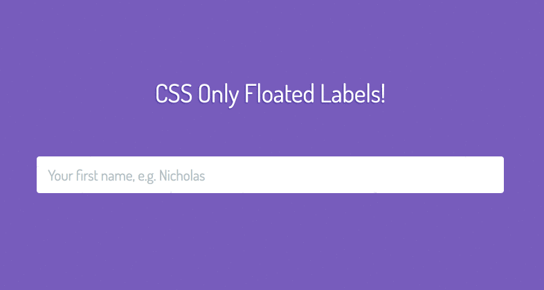

<div class="ButtonGroup ButtonGroup--gutter-md ButtonGroup--align-center">
  <a href="https://codepen.io/callmenick/pen/OxpKNZ" class="Button Button--display-inlineBlock Button--appearance-secondary Button--size-sm">
    Get Source
  </a>
  <a href="https://codepen.io/callmenick/full/OxpKNZ/" class="Button Button--display-inlineBlock Button--appearance-secondary Button--size-sm">
    View Demo
  </a>
</div>


## The Floated Labels Technique

When we’re dealing with inputs, there’s a host of techniques to consider in order to give users the best experience. We need to make sure that we’re giving users necessary information at all points in time, and that means finding the balance between too much and too little. Two pretty important pieces to the UX puzzle are:

1. The `label` element which [according to the MDN](https://developer.mozilla.org/en-US/docs/Web/HTML/Element/input#The_%3Clabel%3E_element), is the only way to provide explanatory information about a form field that is *always* appropriate

2. The `placeholder` attribute for the `input` element, which [according to the MDN](https://developer.mozilla.org/en-US/docs/Web/HTML/Element/input#The_placeholder_attribute), lets you specify a text that appears within the `<input>` element’s content area itself when empty. It’s intended to be used to show an example input, rather than an explanation or prompt.

These two elements can be used in tandem to create instructive form UI, and one pleasant way of doing so is what I call the “floated label technique”. In this UI implementation, the user encounters this flow:

1. They see an `input` with a `placeholder` showing some descriptive example input, and the `label` is initially hidden.
2. When they focus on the `input` and start typing, the meaningful `label` animates and _floats_ above the input.
3. As long at the input has a value, the label remains visible and floated above the input to remind users the original meaning of the input

This UI technique does indeed slightly bend the definitions of `label` and `placeholder` listed above, in the sense that we’re giving the `placeholder` more initial importance in having to explain the input to the user, but it’s a tradeoff for a neat UI component, and one that I’m personally comfortable making. Here’s a quick preview of what we’re going to build.



## Floating Labels With Only CSS

Registering a focus event, determining if an input has value, animating a hidden element into view, deciding whether it needs to stay in view or not depending on input value... this seems like a job for JavaScript, right? **Wrong!** We’re gonna use a neat CSS pseudo class, [`:placeholder-shown`](https://developer.mozilla.org/en-US/docs/Web/CSS/:placeholder-shown), to achieve the effect. From the MDN:

> The **:placeholder-shown** [CSS](https://developer.mozilla.org/en-US/docs/Web/CSS) [pseudo-class](https://developer.mozilla.org/en-US/docs/CSS/Pseudo-classes) represents any [`<input>`](https://developer.mozilla.org/en-US/docs/Web/HTML/Element/input) or [`<textarea>`](https://developer.mozilla.org/en-US/docs/Web/HTML/Element/textarea) element that is currently displaying [placeholder text](https://developer.mozilla.org/en-US/docs/Web/HTML/Element/input#attr-placeholder).

In other words, if an `input` has any value in it, we can safely assume that the `:placeholder-shown` pseudo class will never be reached in our CSS.

Here’s the train of thought I came up with to achieve the floated labels technique using this info:

1. Structure my markup such that I could target my `label` as a [adjacent sibling combinator](https://developer.mozilla.org/en-US/docs/Web/CSS/Adjacent_sibling_selectors) from my `input`, and wrap the two elements in a containing `div`.
2. Style my `input` and `label` accordingly, including the `::placeholder` pseudo element.
3. Move the `label` to its starting position, which is vertically centred in the containing `div`, and hide it.
4. Determine when to show the label by using a combination of the `:not`, `:focus` and `:placeholder-shown` pseudo classes:
   1. If there’s no placeholder shown, then show the label — `input:not(:placeholder-shown) + label`
   2. If the input is focused and the placeholder isn’t shown, then show the label — `input:focus:not(:placeholder-shown) + label`

With that in mind, let’s get to the HTML & CSS!

## Building it all

After digesting all this info, the build is actually pretty simple. Here’s the markup I came up with:

```html
<div class="Input">
  <input type="text" id="input" class="Input-text" placeholder="Your first name, e.g. Nicholas">
  <label for="input" class="Input-label">First name</label>
</div>
```

And here’s the CSS scaffolding with some comments about what’s happening at each step. The final demo down below has the full CSS, which is written up with [CSS variables](https://developer.mozilla.org/en-US/docs/Web/CSS/Using_CSS_variables) for easy modification and maintenance.

```css
.Input {
  /**
   * Relative positioning on the wrapper is important, beecause we'll use the
   * wrapper to position the label in default and floated positions.
   */
  position: relative;
}

.Input-text {
  /**
   * Input text styles here. The font size and line height of the input are
   * important for determining precise positioning of the label. These will be
   * stored in CSS variables eventually.
   */
  display: block;
  margin: 0;
  width: 100%;
  /**
   * These props will be added in the demo once variables are defined:
   *
   * padding
   * font-size
   * line-height
   */
}

.Input-text:focus {
  /**
   * Focused input styles here.
   */
}

.Input-label {
  /**
   * The label gets absolute positioning, and a calculated set of  sizes,
   * positioning, and transforms, based on relativity to the container element
   * and input text styles.
   */
  display: block;
  position: absolute;
  opacity: 0;
  /**
   * These props will be added in the demo once variables are defined:
   *
   * bottom
   * left
   * font-size
   * line-height
   * transform
   * transform-origin
   * transition
   *
   * They will give the label default positioning and styling.
   */
}

.Input-text:placeholder-shown + .Input-label {
  /**
   * While the placeholder is visible, we want to hide the label.
   */
  visibility: hidden;
  z-index: -1;
}

.Input-text:not(:placeholder-shown) + .Input-label,
.Input-text:focus:not(:placeholder-shown) + .Input-label {
  /**
   * While the placeholder is not shown - i.e. the input has a value - we want
   * to animate the label into the floated position.
   */
  visibility: visible;
  z-index: 1;
  opacity: 1;
  /**
   * These props will be added in the demo once variables are defined:
   *
   * transform
   * transition
   *
   * They will give the label floated positioning and styling.
   */
}
```

## Full Demo In Action

If any of the above was unclear, here’s a full working demo in action for you to take a look over!

<p data-height="360" data-theme-id="5513" data-slug-hash="OxpKNZ" data-default-tab="css,result" data-user="callmenick" data-pen-title="CSS Only Floated Labels" data-preview="true" class="codepen">See the Pen <a href="https://codepen.io/callmenick/pen/OxpKNZ/">CSS Only Floated Labels</a> by Nick Salloum (<a href="https://codepen.io/callmenick">@callmenick</a>) on <a href="https://codepen.io">CodePen</a>.</p>
<script async src="https://static.codepen.io/assets/embed/ei.js"></script>

## Browser Support

Support is pretty good so far, with IE & Edge falling behind:

- **Chrome:** 47+
- **Firefox:** 51+
- **IE:** No support
- **Edge:** No support
- **Opera:** 34+
- **Safari:** 9+

You can get around lack of support by using some [fun CSS browser hacks](http://browserhacks.com/) to target IE and Edge browsers for some conditional styles to the input and label.

## Wrap Up

And that’s a wrap! I love when I discover new things in CSS, but I love even more when I can find neat ways to make them applicable. I hope you learned something and can come up with fun new ways to use the `:placeholder-shown` pseudo class. Thanks again for reading, and if you have and questions, comments, or feedback, feel free to <a href="http://twitter.com/home?status=@nicksalloum_ I got a question for you!" target="_blank">send me a tweet.</a>

<div class="ButtonGroup ButtonGroup--gutter-md ButtonGroup--align-center">
  <a href="https://codepen.io/callmenick/pen/OxpKNZ" class="Button Button--display-inlineBlock Button--appearance-secondary Button--size-sm">
    Get Source
  </a>
  <a href="https://codepen.io/callmenick/full/OxpKNZ/" class="Button Button--display-inlineBlock Button--appearance-secondary Button--size-sm">
    View Demo
  </a>
</div>

