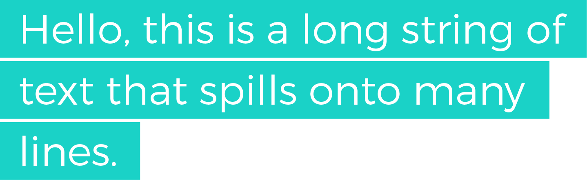
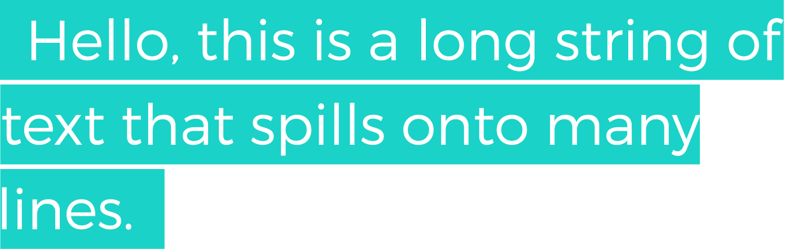

<div class="ButtonGroup ButtonGroup--gutter-md ButtonGroup--align-center">
  <a href="http://codepen.io/callmenick/pen/yVJger" class="Button Button--display-inlineBlock Button--appearance-secondary Button--size-sm">
    Get Source
  </a>
  <a href="http://codepen.io/callmenick/pen/yVJger" class="Button Button--display-inlineBlock Button--appearance-secondary Button--size-sm">
    View Demo
  </a>
</div>

## Stumbling Upon New CSS Is Fun

I love stumbling upon CSS properties in time of great need. Recently, I was working on a personal project, and I wanted to have multi-line highlighted text. My requirements were pretty simple from a design point of view:

1. Text should be highlighted, i.e. have a background colour
2. Highlights should only cover areas where there is text
3. Each line should have a little left and right padding so that the text isn't flush against the highlight box

My desired HTML was something like this:

```html
<span>Hello, this is a long string of text that spills onto many lines</span>
```

And the desired output something like this:



I wanted a CSS-only solution, and one that was simple and elegant. After some very basic experimentation, I came to my first conclusion:

> The element that contains the text string must be set to `display: inline`.

The reasons for this are:

1. If my element was `inline-block`, I'd get the desired effect right up until text spills onto a new line. At that point, subsequent lines would inherit the full width of the parent because of how `inline-block` works.
2. If my element was a `block` element, it would always assume the full width of the parent (unless explicitly declared, which is not an option), thus leading to the same behaviour above.

Both of these reasons would yield the following result:


So why not just use `inline` display and be done with it, you're probably wondering? Well, the issue with using it as is lies in this requirement:

> Each line should have a little left and right padding so that the text isn't flush against the highlight box

If I used it as is, the output would look something like this:



So, how can we solve this? Luckily, CSS has thrown us a piece of candy in the `box-decoration-break` property. Let's take a look.

## The `box-decoration-break` Property

Here's an excerpt from the [MDN:](https://developer.mozilla.org/en-US/docs/Web/CSS/box-decoration-break)

> The box-decoration-break CSS property specifies how the background, padding, border, border-image, box-shadow, margin and clip of an element is applied when the box for the element is fragmented. Fragmentation occurs when an inline box wraps onto multiple lines&hellip;

Basically, this property is giving us a bit more granularity in how an inline element gets rendered. By default, it's set to `slice`, which means that it treats the inline box as if it weren't fragmented at all. I like to think of it like this. Imagine that we took that multi-line inline element, stretched it out onto one line, applied the styling, sliced it into pieces, then moved each piece back to a new line. The result would be that the properties mentioned above would act on the entire box of the element, rather than each of its parts.

However, there is a second option for us, and that is:

```css
.element {
  box-decoration-break: clone;
}
```

When we set the property to `clone`, we can imagine a similar scenario as above, except one important thing. This time, let's imagine that all the styles get applied **after** the element gets fragmented and distributed on multiple lines. In other words, paddings, borders, etc would be applied to each fragment almost as if they were separate elements.

That's pretty awesome, and with one simple property, we've unleashed a ton of possibilities! [Here's a CodePen link with various demos for you to play around with.](http://codepen.io/callmenick/pen/yVJger)

## Browser Support

Support is decent, with IE falling behind on implementation. Most browsers that do support it only support it for inline elements. However, luckily, if a browser doesn't support it, the consequences won't be dramatic, and providing a fallback solution should be very simple.

## Wrap Up

And that's a wrap! In this little snippet, we looked at some default behaviours for `inline`, `inline-block`, and `block` elements, and introduced a property that gives us more granular control over rendering. I hope you learned something! Thanks again for reading, and if you have and questions, comments, or feedback, feel free to <a href="http://twitter.com/home?status=@nicksalloum_ I got a question for you!" target="_blank">send me a tweet.</a>

<div class="ButtonGroup ButtonGroup--gutter-md ButtonGroup--align-center">
  <a href="http://codepen.io/callmenick/pen/yVJger" class="Button Button--display-inlineBlock Button--appearance-secondary Button--size-sm">
    Get Source
  </a>
  <a href="http://codepen.io/callmenick/pen/yVJger" class="Button Button--display-inlineBlock Button--appearance-secondary Button--size-sm">
    View Demo
  </a>
</div>
