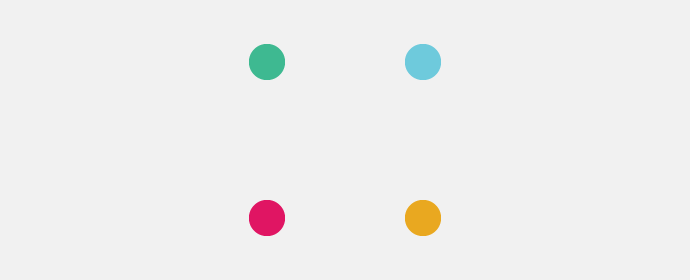
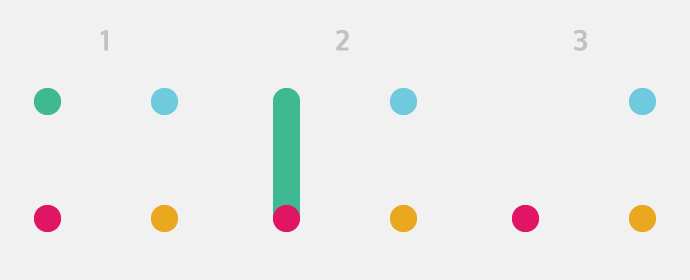
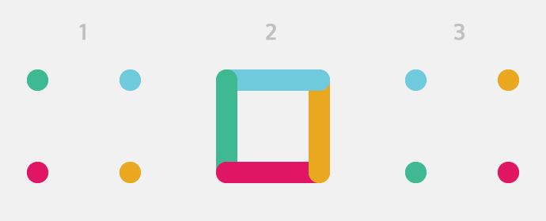
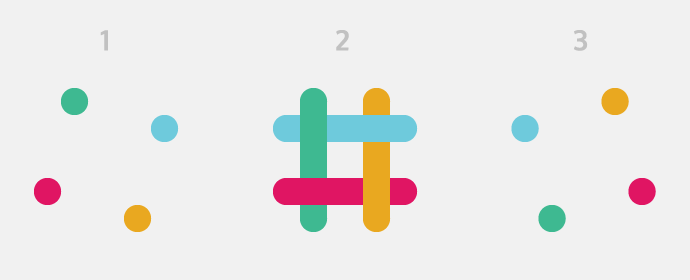

<div class="ButtonGroup ButtonGroup--gutter-md ButtonGroup--align-center">
  <a href="https://codepen.io/callmenick/pen/eNRdEy?editors=1100" class="Button Button--display-inlineBlock Button--appearance-secondary Button--size-sm">
    Get Source
  </a>
  <a href="https://codepen.io/callmenick/full/eNRdEy" class="Button Button--display-inlineBlock Button--appearance-secondary Button--size-sm">
    View Demo
  </a>
</div>

## Slack & The Logo

[Slack](https://slack.com/) is making waves these days, and they're a cool company with a great brand identity in my opinion. The app itself is really pleasant, and makes group and team communication great. I chose this as a subject for a CSS experiment, because the logo itself is utilised when loading indicators are required. Another reason that it's a good subject is because by dissecting it a bit, we can really see some of the depths and powers of CSS3 animations and transforms.

If you look at the logo, it consists of 4 main coloured dots. These dots expand into bars, then shrink again, then move back to the original position. They also overlap a bit, and the entire logo is adjusted to an angle. With some simple math and Sass variables, constructing the logo and animation step by step isn't so hard. In this tutorial, we'll go over that, covering some ground on animations as well. By the end, you should have gained some knowledge to take forward with you into other CSS animation projects.

Here's a sneak peek of what we'll be building:

<p data-height="300" data-theme-id="5513" data-slug-hash="eNRdEy" data-default-tab="result" data-user="callmenick" data-pen-title="Slack Logo CSS Animation" data-preview="true" class="codepen">See the Pen <a href="https://codepen.io/callmenick/pen/eNRdEy/">Slack Logo CSS Animation</a> by Nick Salloum (<a href="https://codepen.io/callmenick">@callmenick</a>) on <a href="https://codepen.io">CodePen</a>.</p>

Let's dive in!

## The Logo's Markup

As I mentioned above, the logo consists of 4 main dots/bars, each of which are a different colour. These dots will all be nested relatively inside a parent container. Each dot will also have its own modifier, which will enable us to add custom positioning, colours, and animations to each one. Here's the markup:

```html
<div class="slack">
  <span class="dot dot--a"></span>
  <span class="dot dot--b"></span>
  <span class="dot dot--c"></span>
  <span class="dot dot--d"></span>
</div>
```

You shouldn't see anything special in the browser just yet. In fact, you shouldn't see anything at all! We need some CSS.

## Setting Up With Sass Variables & A Parent Class

I've leveraged Sass (SCSS) to handle some variables and math operations. It makes life a whole lot easier in general, but particularly for projects like this where positioning is mathematically calculate. Let's think about some variables that we'll use:

1. We definitely want a set size for the logo. I've chosen 96px, which will form a square container.
2. I also chose a diameter for the dots. 18px seemed reasonably proportional to the 96px size.
3. The final logo should be rotated at an angle. I chose 15 degrees based on my dimensions.
4. There's also a duration for the animation that needs to be set. 2 seconds seemed nice to me.
5. Finally, the logo consists of 4 different colours. I set them up here as variables for simplicity.

Here's the variable block I used:

```scss
$slack-size: 96px;
$dot-diameter: 18px;
$slack-angle: 15deg;
$duration: 2s;

$slack-blue: #6ecadc;
$slack-yellow: #e9a820;
$slack-pink: #e01563;
$slack-green: #3eb991;
```

At this time, it's important to note that the final CSS animating logo may not be an dimensionally exact replica of the original logo (although it can easily be done by simple measuring the original logo's dimensions). The emphasis here is how we build it and animate it.

Let's move onto some styles for the parent class. Everything inside it will be absolutely positioned, so we want it to be relatively positioned. I also made use of some of the variables above. Here's the SCSS so far:

```scss
.slack {
  position: relative;
  z-index: 100;
  margin: 80px auto;
  width: $slack-size;
  height: $slack-size;
}
```

We still shouldn't have anything visual, although while I was building it, I made use of a semi-transparent background colour to see the parent container. In any case, let's move onto the actual dots.

## Positioning The Dots

Each dot is absolutely positioned inside the parent container, and has a border radius equal to the diameter/2. The individual dots are also positioned separately using the `top`, `right`, `bottom`, and `left` properties. Naturally, we need one in the top-left corner, one in the top-right corner, one in the bottom-right corner, and one in the bottom-left corner. They also need background colours, as defined in the variable block above. Here's the SCSS:

```scss
.dot {
  display: block;
  position: absolute;
  width: $dot-diameter;
  height: $dot-diameter;
  border-radius: $dot-diameter/2;
}

.dot--a {
  top: 0;
  left: 0;
  background-color: $slack-green;
}

.dot--b {
  top: 0;
  right: 0;
  background-color: $slack-blue;
}

.dot--c {
  bottom: 0;
  right: 0;
  background-color: $slack-yellow;
}

.dot--d {
  bottom: 0;
  left: 0;
  background-color: $slack-pink;
}
```

We should now have something looking like this:



It's a good start! Let's move onto the animations.

## The Animations

Let's animate the first dot, "dot a". If we think it through, we want it to first increase in height to the `$slack-size` variable. After that, it should shrink again to just a dot, but this time, it should be fixed to the opposite end. Finally, the dot needs to move back to its original position to get ready to animate again. Our parent container makes life easy when it comes to positioning the dots due to the absolute/relative combination. Here's the animation for dot a:

```scss
@keyframes dot--a {
  0% {
    top: 0;
    bottom: auto;
    height: $dot-diameter;
  }
  33% {
    top: 0;
    bottom: auto;
    height: $slack-size;
  }
  34% {
    top: auto;
    bottom: 0;
    height: $slack-size;
  }
  66% {
    top: auto;
    bottom: 0;
    height: $dot-diameter;
  }
  100% {
    top: auto;
    bottom: $slack-size - $dot-diameter;
    height: $dot-diameter;
  }
}
```

At this point, nothing would've changed in the browser. That's because we have to include the animations for the dot. Let's do that for dot a:

```scss
.dot--a {
  animation: dot--a $duration infinite;
}
```

Now our sequence should look like this:



Let's do something similar for each of the other three dots. Dot b starts in the top right corner, expands to the left, shrinks to the left, and moves back to the right. Here's the animation:

```scss
@keyframes dot--b {
  0% {
    right: 0;
    left: auto;
    width: $dot-diameter;
  }
  33% {
    right: 0;
    left: auto;
    width: $slack-size;
  }
  34% {
    right: auto;
    left: 0;
    width: $slack-size;
  }
  66% {
    right: auto;
    left: 0;
    width: $dot-diameter;
  }
  100% {
    right: auto;
    left: $slack-size - $dot-diameter;
    width: $dot-diameter;
  }
}
```

Don't forget to include the animation on the dot:

```scss
.dot--b {
  animation: dot--b $duration infinite;
}
```

Now for dot c. It starts in the bottom right, expands up, shrinks up, and moves back down:

```scss
@keyframes dot--c {
  0% {
    bottom: 0;
    top: auto;
    height: $dot-diameter;
  }
  33% {
    bottom: 0;
    top: auto;
    height: $slack-size;
  }
  34% {
    bottom: auto;
    top: -($slack-size - $slack-size);
    height: $slack-size;
  }
  66% {
    bottom: auto;
    top: -($slack-size - $slack-size);
    height: $dot-diameter;
  }
  100% {
    bottom: auto;
    top: $slack-size - $dot-diameter;
    height: $dot-diameter;
  }
}
```

Here's the inclusion of the animation for dot c:

```scss
.dot--c {
  animation: dot--c $duration infinite;
}
```

And finally, dot d. It starts in the bottom left, expands right, shrinks right, and moves back left. Here's the animation:

```scss
@keyframes dot--d {
  0% {
    left: 0;
    right: auto;
    width: $dot-diameter;
  }
  33% {
    left: 0;
    right: auto;
    width: $slack-size;
  }
  34% {
    left: auto;
    right: -($slack-size - $slack-size);
    width: $slack-size;
  }
  66% {
    left: auto;
    right: -($slack-size - $slack-size);
    width: $dot-diameter;
  }
  100% {
    left: auto;
    right: $slack-size - $dot-diameter;
    width: $dot-diameter;
  }
}
```

Once more, include the animation for the dot:

```scss
.dot--d {
  animation: dot--d $duration infinite;
}
```

Now, we should see this sequence in the browser:



Awesome, we're getting there! Let's move on.

## Overlapping By Translating

In the actual logo animation, the dots and bars overlap each other. We can achieve this by nudging each dot inwards a little bit using translations. I just used the dot diameter as a base for this translation. Here's the SCSS for this:

```scss
.dot--a {
  transform: translateX($dot-diameter);
}

.dot--b {
  transform: translateY($dot-diameter);
}

.dot--c {
  transform: translateX(-$dot-diameter);
}

.dot--d {
  transform: translateY(-$dot-diameter);
}
```

Now, the sequence should look like this:



Much better! On we go.

## Rotating The Entire Logo

The slack logo animation looks great, but in reality, the whole thing happens at a tilted angle. Because of our parent class, this is really easy to achieve! We can just add a rotation on it:

```scss
.slack {
  transform: rotate(-$slack-angle);
}
```

The full sequence should now look like this:


Awesome! That's just about it...but we're missing one final little touch.

## Mixing The Colours

There is just one last touch to pull it all together, and that doesn't involve animations at all. It does, however, involve some modern CSS blending. Let's add a multiplying mix blend mode on all the dots to create a sweet little mixup of the colours when they pass each other. This also brings the animation much more true to life, like the original version. Here's the styles for that:

```scss
.dot {
  mix-blend-mode: multiply;
}
```

And finally, here's the sequence:


Awesome! Stare at the magic of modern CSS. Here it is again in action.

<p data-height="300" data-theme-id="5513" data-slug-hash="eNRdEy" data-default-tab="result" data-user="callmenick" data-pen-title="Slack Logo CSS Animation" data-preview="true" class="codepen">See the Pen <a href="https://codepen.io/callmenick/pen/eNRdEy/">Slack Logo CSS Animation</a> by Nick Salloum (<a href="https://codepen.io/callmenick">@callmenick</a>) on <a href="https://codepen.io">CodePen</a>.</p>

## Final Notes

By approaching any animation sequence step by step, and leveraging some simple math and modern CSS properties, we're able to open up a world of possibilities. CSS blend modes are also a pretty neat feature too, so get your head into that too!

Throughout the tutorial, I used un-prefixed CSS for the sake of brevity. Make sure that you include all necessary vendor prefixes. I recommend using a post-CSS tool like auto-prefixer for that.

## Wrap Up

Thanks again for reading, and if you have and questions, comments, or feedback, feel free to <a href="http://twitter.com/home?status=@nicksalloum_ I got a question for you!" target="_blank">send me a tweet.</a>

<div class="ButtonGroup ButtonGroup--gutter-md ButtonGroup--align-center">
  <a href="https://codepen.io/callmenick/pen/eNRdEy?editors=1100" class="Button Button--display-inlineBlock Button--appearance-secondary Button--size-sm">
    Get Source
  </a>
  <a href="https://codepen.io/callmenick/full/eNRdEy" class="Button Button--display-inlineBlock Button--appearance-secondary Button--size-sm">
    View Demo
  </a>
</div>

<script async src="https://static.codepen.io/assets/embed/ei.js"></script>
